# main.py モジュール関係図（合成ルート中心）

`main.py` を中心に、**直接 import・配線しているモジュール**と、その一段下の主要な関係だけに
絞った関係図。`main.py` リファクタを継続する際の地図として使う。

> ⚠️ **同期ルール（main.py と連動）**
> この図は `pipeline_youtube/main.py` の **import / オーケストレーション配線**を反映したもの。
> **main.py の import・呼び出し・段階の順序を変えたら、この図も同じ PR で更新すること。**
> `CLAUDE.md` の「Architecture invariant: main.py is a thin orchestrator」と対になる資料で、
> 「main.py に HOW が漏れていないか（＝この図のノードが増えていないか / 矢印が複雑化していないか）」
> を点検するために使う。図が読みづらくなったら、それは main.py が太りはじめたサイン。

## 関係図

```mermaid
graph TD
    CLI([CLI 引数 / オプション]) --> MAIN

    MAIN["<b>main.py</b><br/>合成ルート / オーケストレータ<br/>(CLI定義・実行順序・配線・終了/エラー処理 のみ)"]

    subgraph CONFIG["① 設定・前提（起動時の配線）"]
        CFG["cli_config.py<br/>_load_config → CliConfig"]
        CONF["config.py<br/>set_vault_root / set_dry_run"]
        CLAUDEBIN["providers/claude_cli.py<br/>get_resolved_claude_binary"]
        WHISPER["transcript/whisper_fallback.py<br/>configure_whisper"]
        SANI["sanitize.py<br/>configure_alert_sink"]
    end

    subgraph INPUT["② 入力・分類"]
        PLAYLIST["playlist.py<br/>fetch_metadata → VideoMeta"]
        GENRES["genres.py<br/>classify_playlist_genre"]
    end

    subgraph RESUME["③ 再開・チェックポイント"]
        RES["resume.py<br/>_load_existing_04_body / _filter_to_reviewed /<br/>_collect_existing_learning_bodies"]
        CKPT["checkpoint.py<br/>get_completed_video_ids"]
    end

    subgraph PERVIDEO["④ 動画ごとの処理（Stage 01-04）"]
        VP["video_processing.py<br/>_process_video / _run_videos_concurrent"]
        SCRIPTS["stages/scripts.py<br/>run_stage_scripts（字幕取得 tier0-3）"]
        CAPTURE["stages/capture.py"]
        SUMMARY["stages/summary.py"]
        LEARNING["stages/learning.py"]
        RR["run_result.py<br/>VideoRunResult / _print_cost_breakdown"]
    end

    subgraph PN["⑤ 固有名詞・用語集"]
        PNS["proper_noun_sheet.py<br/>_update_proper_noun_sheet /<br/>_promote_corrections_to_glossary"]
        GLOSS["glossary.py<br/>load_sheet / correction_glossary"]
    end

    subgraph SYN["⑥ 統合（Stage 05）"]
        SYNTH["stages/synthesis.py<br/>run_stage_synthesis"]
        AGENTS["synthesis/agents.py<br/>compute_synthesis_timeouts"]
    end

    subgraph SUBAGENT["並列 sub-agents 経路"]
        PAR["parallel.py<br/>orchestrate_sub_agents / parse_video_range"]
    end

    MAIN --> CFG & CONF & CLAUDEBIN & WHISPER & SANI
    MAIN --> PLAYLIST & GENRES
    MAIN --> RES & CKPT
    MAIN --> VP
    MAIN --> PNS & GLOSS
    MAIN --> SYNTH & AGENTS
    MAIN --> PAR
    MAIN --> RR

    %% 一段下の主要な関係（HOW はモジュール側に閉じている）
    VP --> SCRIPTS & CAPTURE & SUMMARY & LEARNING
    VP --> RR
    PNS --> GLOSS
    SYNTH --> AGENTS

    classDef root fill:#1f6feb,color:#fff,stroke:#0b3d91,stroke-width:2px;
    classDef ext fill:#eee,color:#333,stroke:#999,stroke-dasharray:3 3;
    class MAIN root;
    class CLI ext;
```

## 読み方（main.py の責務 = 配線のみ）

| 段階 | main.py がやること（普遍的な制御フロー） | HOW を持つモジュール（呼ぶだけ） |
|---|---|---|
| ① 設定 | config.json 読込・vault/whisper/alert の初期化を**配線** | `cli_config` / `config` / `providers/claude_cli` / `whisper_fallback` / `sanitize` |
| ② 入力 | URL 検証 → メタdata 取得 → ジャンル分類を**呼ぶ** | `playlist` / `genres` |
| ③ 再開 | 既存出力・完了IDの探索を**呼ぶ**（resume / synthesis-only 経路） | `resume` / `checkpoint` |
| ④ 動画処理 | 逐次 or 並列で 1 動画パイプラインを**起動** | `video_processing`（内部で `stages/*` を駆動し `VideoRunResult` を返す） |
| ⑤ 固有名詞 | シート更新・用語集昇格を**呼ぶ** | `proper_noun_sheet` / `glossary` |
| ⑥ 統合 | Stage 05 を**呼ぶ** | `stages/synthesis` / `synthesis/agents` |
| 出力 | コスト集計の表示を**呼ぶ** | `run_result._print_cost_breakdown` |
| 並列 | `--sub-agents` 時の分散を**委譲** | `parallel.orchestrate_sub_agents` |

ポイント：矢印はすべて **main.py → モジュール（呼び出し / 配線）** か、
**モジュール → モジュール（HOW の内部関係）**。`main.py` 自身にロジック・分岐・I/O は無い。
新機能で **main.py から伸びる矢印が増える＝配線**、**main.py の中に処理が増える＝抽出のサイン**。

## 継続リファクタの指針

- 新しい段階・切替は **既存モジュールへ寄せる**か **新モジュールを足してこの図にノード追加**。
  `main.py` の本体には `if/elif` を生やさず、config 値 + registry/strategy で表現する
  （例: `stages/scripts.py` の `fetchers=[("innertube", …), ("official", …), …]`）。
- この図の **subgraph（①〜⑥）= main.py の実行フェーズ**。フェーズ内が太ったら、その subgraph を
  さらに 1 モジュールへ括り出せないか検討する。
